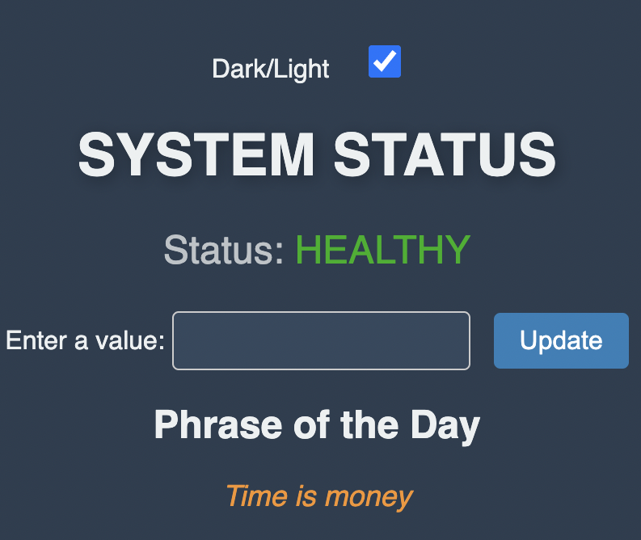
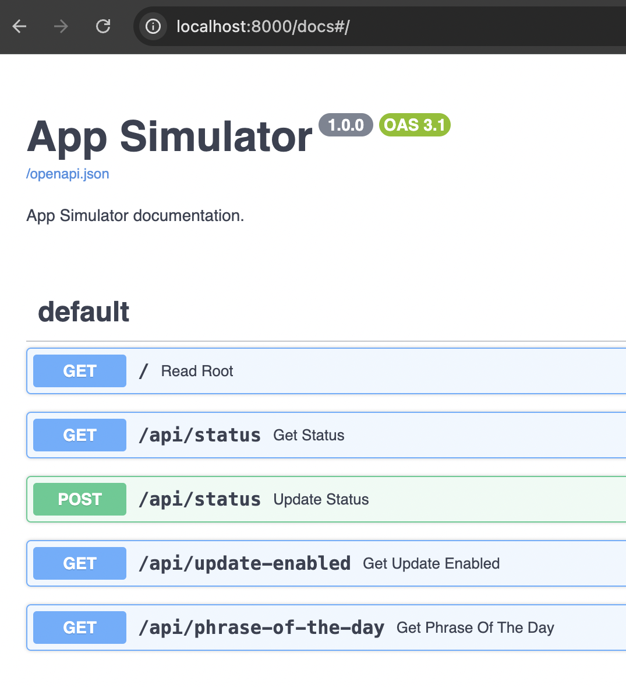
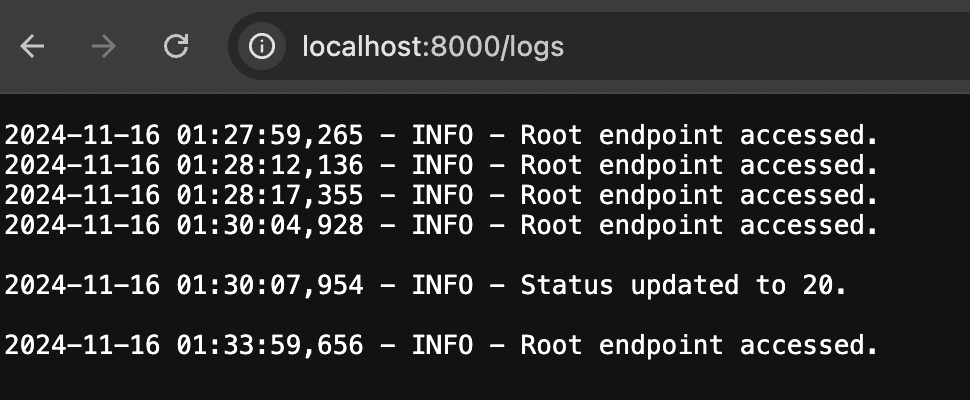

# 🚀 **Getting started**

## 🐳 **Containerization**

### ✅ Build Docker image locally and run code inside a container
```
docker-compose up --build -d    
```

### 🚫 Stop and remove containers
```
docker-compose down
```

## ☸️ **Kubernetes (K8s) Deployment**

## **Make sure you have a Kubernetes cluster available**

Before proceeding, ensure that you have a running Kubernetes cluster. You can use [Minikube](https://minikube.sigs.k8s.io/docs/) for local development or a managed cluster in a cloud (e.g. `AWS`, `GCP`, `Azure` etc.)

### 🌐 You can check the connection to your cluster by running:
```
kubectl cluster-info
```

### 🛠 Apply the Kubernetes Deployment YAML file:
```
kubectl -- apply -f app-simulator-deployment.yaml
```

### 🛠 Get application pod:
```
kubectl get pods
```

### 🛠 Port-forward to access the application locally
```
kubectl port-forward pod/<app pod> 8000:8000
```


## Preview

### 🖥️ UI
`http://localhost:8000/`



### 📝 Swagger Documentation
`http://localhost:8000/docs#/`



### 📁 Logs
`http://localhost:8000/logs`



## 🗄️ **Database schema**

* Table `config`
- `id`: SERIAL, PRIMARY KEY
- `status_value`: INTEGER, NOT NULL
- `is_update_enabled`: BOOLEAN, NOT NULL, DEFAULT TRUE
- `Description`: This table stores the configuration settings for the application. It does not have direct relationships with other tables.
_____

* Table `phrases`
- `id`: SERIAL, PRIMARY KEY
- `ru_text`: TEXT
- `en_text`: TEXT
- `Description`: This table contains phrases in RU/EN languages. 
_____

* Table `language_config`
- `id`: SERIAL, PRIMARY KEY
- `language`: VARCHAR(2), NOT NULL
- `Description`: This table represents the language configuration. The table has no database relationship with the phrase table, but the backend code depends on this table and its language column to determine which RU/EN phrases should be retrieved in the UI. This means that if the language column of this table currently has the value EN, then the backend code will only retrieve English text from the phrase table.
______